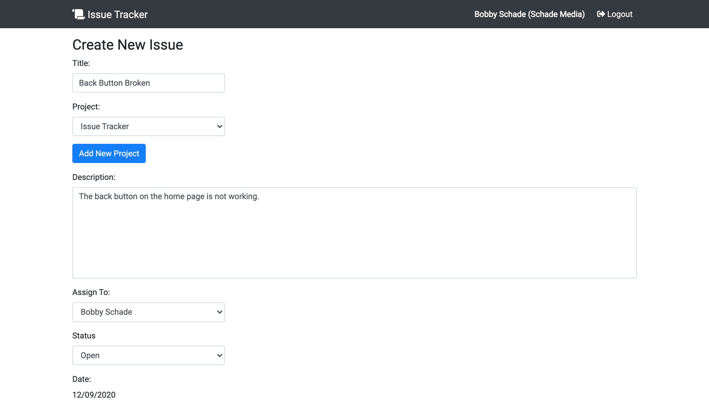

# IssueTracker 1.0

> Keep track of bugs, issues, and to-dos among you and your team or organization - or just yourself!

This is an bug/issue/todo tracking application built with the MERN stack. It includes authentication and CRUD functionality for logged issues.

# Quick Start 🚀

### Install server dependencies

```bash
npm install
```

### Install client dependencies

```bash
cd client
npm install
```

### Run both Express & React from root

```bash
npm run dev
```

### Build for production

```bash
cd client
npm run build
```

## App Info



### Author

Bobby Schade
[Portfolio](http://www.bobbyschade.com)

### Version

1.0.0

### License

This project is licensed under the MIT License
